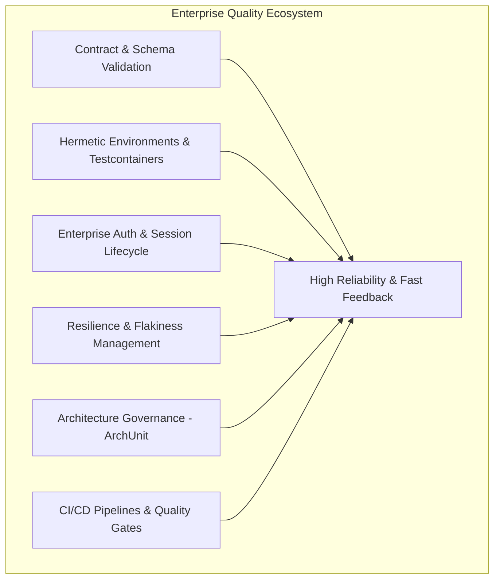

# Requirements

### Overview & Goals
The goal is to systematically evaluate and design an enterprise-grade extension roadmap for the REST API test automation framework. The plan prioritizes additions based on measurable utility — maximizing defect detection capability, test execution speed, system reliability, and maintainability while minimizing infrastructure overhead and operational friction.

### Scope
- **In Scope:**
  - Identification and detailed elaboration of enterprise-level automation practices (Contract testing, Mocking/Service Virtualization, Security/JWT lifecycle, Testcontainers, Resiliency/Flakiness mitigation, Architecture governance via ArchUnit, CI/CD & Quality Gates, Non-functional/SLA validations).
  - Creation of a structured documentation file `docs/ENTERPRISE_ROADMAP.md` detailing these recommendations, libraries, ROI justification, and implementation patterns.
  - Adding a lightweight navigation pointer in `README.md` to keep the main guide clean.
- **Out of Scope:**
  - Bloating the root `README.md` with verbose code snippets.
  - Immediate refactoring of all existing tests (this is a strategic plan & documentation deliverable).

### Value & Utility Evaluation Framework
Enterprise capabilities are evaluated against four key metrics:
1. **Defect Catching Potential (ROI):** Ability to detect breaking API changes, contract violations, and data inconsistencies before reaching production.
2. **Determinism & Stability:** Elimination of false positives, flaky network behaviors, and shared state dependencies.
3. **Developer & QA Velocity:** Time saved during test authoring, onboarding, and pipeline execution.
4. **Maintenance Overhead:** Minimizing the ongoing effort required to maintain fixtures, mocks, and test suites.

# Technical Design

### Current Implementation
The current project provides a foundation:
- Java 21, REST Assured, JUnit 5, Allure Report, AssertJ custom assertions, Owner, Jackson, DataFaker, Logback.
- Layered architecture with separated Clients, DTOs, Data Factories, Specs, and Tests.

### Target Documentation Structure
We will introduce a dedicated `docs/` directory with `docs/ENTERPRISE_ROADMAP.md` organized into practical thematic domains:

```
docs/
└── ENTERPRISE_ROADMAP.md
```

### Categorized Enterprise Capabilities Catalog



#### 1. Contract Testing & Schema Governance (High ROI / Low Maintenance)
- **JSON Schema Validation (`rest-assured-json-schema-validator` / NetworkNT):** Automatically assert response schemas against OpenAPI specs or JSON schemas to prevent undetected API drift.
- **Consumer-Driven Contracts (Pact / Spring Cloud Contract):** Validate compatibility between microservice producers and consumers without running full end-to-end environments.

#### 2. Service Virtualization & Mocking (Stability & Isolation)
- **WireMock / MockServer:** Simulate third-party dependencies, rate limits, 5xx server failures, and slow network responses in isolated integration suites.
- **Testcontainers:** Spin up lightweight ephemeral dependencies (PostgreSQL, Redis, Kafka, MockServer) directly from JUnit 5 lifecycles to ensure 100% reproducible test runs.

#### 3. Advanced Auth & Token Lifecycle Management
- **Centralized Token/Session Manager:** Thread-safe JWT caching and transparent token renewal to avoid redundant `/auth/login` calls for every single test request, drastically cutting execution time.
- **Role-Based Access Control (RBAC) Testing Matrix:** Matrix-driven tests verifying permissions across multiple user roles (Admin, Manager, Customer, Anonymous).

#### 4. Architecture Governance & Code Quality (ArchUnit)
- **ArchUnit Tests:** Enforce architectural rules at build time (e.g., ensuring tests never invoke REST Assured directly bypassing Client layers; ensuring DTOs are free of business logic; verifying Allure `@Step` annotations on all client methods).

#### 5. Resilience & Flakiness Management
- **Intelligent Retry & Quarantine Extension:** JUnit 5 extension to automatically re-run flaky tests on transient network errors, report flakiness rates to Allure, and prevent false CI build failures.
- **Soft Assertions Integration:** Evaluate multiple independent assertions in a single test run to collect full failure context rather than failing on the first mismatch.

#### 6. Database Verification & State Setup
- **Direct DB Assertions (jOOQ / Spring Data JDBC / DBI):** Validate that API side-effects (e.g., `POST /orders`) correctly mutate database state, bypass intermediate caches, and ensure data integrity.

#### 7. Non-Functional & SLA / Performance Validation
- **Response Time & SLA Assertions:** Standardize response latency thresholds in `ResponseSpecs` (e.g., `time(lessThan(1200L))`) for critical paths.
- **k6 / Gatling Integration:** Seamless reuse of DTOs and API client models for performance and load test scenarios.

#### 8. Enterprise CI/CD & Reporting Integration
- **GitHub Actions / GitLab CI Workflows:** Parallel test matrix execution, Allure report artifact generation, and deployment to GitHub Pages or S3/Allure TestOps.
- **Failure Notification Webhooks:** Slack / Microsoft Teams / Telegram notifications with direct links to failed test runs and stack traces.

# Delivery Steps

###   Step 1: Create enterprise roadmap documentation
Create a dedicated `docs/` directory and author `docs/ENTERPRISE_ROADMAP.md` containing a structured, prioritized enterprise feature catalog.

- Create `docs/ENTERPRISE_ROADMAP.md` with comprehensive coverage of enterprise practices (Contract Testing, Security/Auth, Testcontainers, CI/CD, ArchUnit, WireMock, Metric/SLA monitoring).
- Group enhancements by utility tier (High ROI / Fast Wins vs Deep Architectural Evolution).
- Provide architectural explanations, code examples, recommended libraries, and concrete implementation recipes for each feature.

###   Step 2: Link roadmap in README.md
Add a clean, concise navigation link and section in `README.md` referencing the newly created enterprise roadmap.

- Update `README.md` with an "Enterprise Roadmap & Future Enhancements" section containing a short summary and direct link to `docs/ENTERPRISE_ROADMAP.md`.
- Ensure `README.md` remains lightweight and clutter-free without bloating the primary onboarding guide.